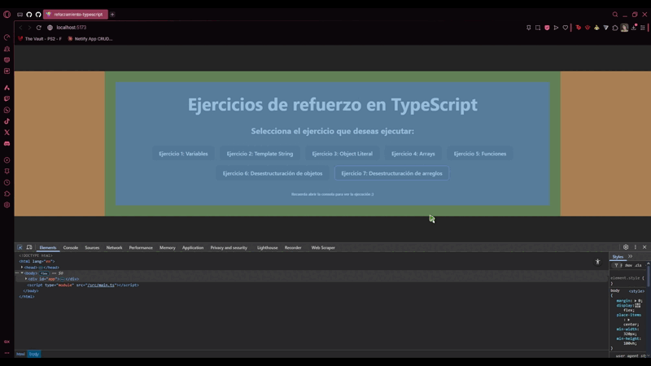

# Documentación
## Integrantes:
 - Sharon Ariadna Rincón Guerrero
 - Cristian Alejandro Rodriguez Rodriguez

 ## Descripción de ejercicios:
 Cada ejercicio se realizó dentro de una función que permite exportar la ejecución por consola de cada ejercicio para poder llamarla posteriormente en botones que brinden una mejor organización.
### *Ejercicio #1*:
1. Declarar una variable const para el nombre de un estudiante.
2. Declarar una variable let para la edad y actualizar su valor.
3. Imprimir ambos valores y explicar en comentarios la diferencia entre const y let.

### *Ejercicio #2*:
1. Declarar variables: nombre, carrera y semestre.
2. Usar template string para mostrar un mensaje en consola.

### *Ejercicio #3*:
1. Definir un objeto estudiante con propiedades: nombre, edad, carrera y semestre.
2. Agregar un método que retorne una descripción.
3. Mostrar la descripción en consola.

### *Ejercicio #4*:
1. Crear un arreglo con calificaciones.
2. Calcular el promedio con un bucle for.
3. Mostrarlo en consola.

Para el desarrollo de este ejercicio se utilizó una función Math.random() en conjunto a Math.floor() para poder utilizar 10 calificaciones aleatorias en el arreglo que estuvieran entre 0.0 y 5.0

### *Ejercicio #5*:
1. Crear una función calcularPromedio.
2. Recibir un arreglo de números y devolver el promedio.
3. Probar la función con calificaciones.

### *Ejercicio #6*:
1. Reutilizar el objeto estudiante.
2. Desestructurar nombre y carrera.
3. Mostrar valores en consola.

### *Ejercicio #7*:
1. Reutilizar el arreglo de calificaciones.
2. Desestructurar el primer y segundo elemento.
3. Mostrar valores en consola.

## Instrucciones de ejecución:
1. Crear una carpeta y abrirla en el IDE de preferencia.
2. Abrir una terminal en el proyecto y ejecutar los siguientes comandos uno por uno:
```
git init
git clone https://github.com/Aria-707/reforzamiento-typescript-grupoRinconRodriguez.git
cd reforzamiento-typescript-grupoRinconRodriguez/reforzamiento-typescript
npm install
npm run dev
```
3. Con el último comando, saldrá un enlace en la consola a la página web donde estará siendo ejecutado el programa. Dirigirse al enlace, ya sea copiando y pegando, o presionando el enlace con Ctrl+Clic


4. El la página web, abrir la consola con clic derecho -> Inspeccionar Elemento. O con Ctrl+Shift+C


5. Dar clic en cualquier parte de la página web y seleccionar Console.



En este punto, ya se puede seleccionar cualquier ejercicio que se desee ejecutar en la consola haciendo clic sobre el botón correspondiente.


